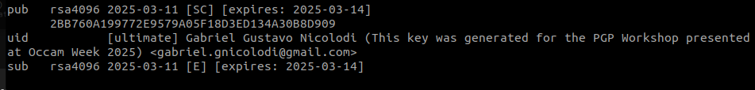

# Useful commands used during the workshop
> This workshop was made for Linux, so, don't expect windows tips in this document, maybe in the future I will do it if I have time. For now, install any Linux distro and you will be happy.

## TL;DR
```bash
# install gpg
sudo apt install gpg

# generate ket
gpg --full-generate-key

# list keys with id
gpg --list-keys --keyid-format=long

# if you need to unset your current git gpg configuration
git config --global --unset gpg.format

# set default signing config for git
git config --global user.signingkey <key-id>

# set git to sign commits by default
git config --global commit.gpgsign true

# set git to sign tags by default
git config --global tag.gpgsign true

```

## Check and install GPG 
Probably GPG is already installed in your distro, so you can check it using:
`which gpg`
If it returns "gpg is not found", you can:

- Install GPG on Debian based distros:

```sudo apt install gpg```

- Install GPG on Fedora/RedHat based distros:

```sudo dnf install gnupg```
or ```sudo dnf install gnupg2```

> For other distros you can search online how to install using the distro's default package manager or install a binary from the [GnuPG releases](https://gnupg.org/download/index.html)

## Generate your first Key:

1 - Run ``` gpg --full-generate-key ```

It will prompt a form on your terminal to create your key.


You can keep the default cryptography kind (RSA and RSA) for signature and encryption.

2 - Now you will need to specify the size of your key in bits, it representes the security level of your key, giving that:
- 1024 bits: is considered unsafe nowadays;
- 2048 bits: is the default and minimum configuration for todays systems;
- 4096 bits: extra security, but slower.


3 - Set the time you want for the key to expire:
- If you want it to be permanent, just leave to 0;


> In this example we are setting it to expire in 3 days.

4 - Now you will need to provide some identification data for your key, but it is optional and you can also set it for any anonymous data.
It will prompt for you to set your:
- Real name
- Email
- A comment

After you insert your data, you can press O (for Okay) to continue or you can press N, C or E for editing your name, comment or Email, or Q for quitting the key configuration.


Now it will ask you to provide a passphrase to protect your Key
> In this tutorial I will leave it blank but it is REALLY IMPORTANT for you to set a good passphrase for your key in order to not have trouble if your key gets leaked.


Now your key was created successfully!!


Note that 
```bash
pub   rsa4096 2025-03-11 [SC] [expires: 2025-03-14]
      2BB760A199772E9579A05F18D3ED134A30B8D909 #<=== this is your public Key
        # And the last 16 characters are the ID of your key => D3ED134A30B8D909
```

## Listing your keys

```gpg --list-keys``` will list all the keys on your gpg keyring




```gpg --list-keys --keyid-format=long``` will display all the keys but it is helpful for getting your key id, where the highlited part above will be the ID of the key (note that it is the last 16 characters of the pubkey)


## Exporting your public key

```gpg --export --armor [ID, name or email of the key]``` will output the public key in ascii format, you can redirect the output to a file using ` > name-of-file` in the end of the command
> `--armor` is used for making the output be in ASCII, because by default it exports as a binary.

> You can also export your Private Key using `gpg --export-secret-keys --armor [ID, name or email of the key]`


> ## Now you have a fully functional GPG Key for yourself :)

## Signing commits with your GPG Key

### Configure your GPG key on your global Git config

First, get your key id

Configure git to use your desired key:

```bash
# set default signing config for git
git config --global user.signingkey <key-id>
```

Now you can simply use 
```bash
git commit -S -m "commit message" 
```
where `-S` is used to sign the commit with GPG

OR 
you can set git to sign all your commits by default, using:

```bash
git config --global commit.gpgsign true

git config --global tag.gpgsign true
```


## Summary of GPG Commands

### Signing a message in cleartext
To sign a message in a readable format, use:
```bash
gpg --clear-sign file.txt
```
This will create a `.asc` file with a plaintext signature.
You can set the key that you want to use for signing with the `--local-user <key id or email>` paramether

### Signing a message in detach format
To sign a message in a detach format, use:
```bash
gpg --detach-sign file.txt
```
This will create a `.sig` file with only the signature that commits to the state of the file you signed.

### Verifying a signed file
To verify a signed file and check its authenticity, run:
```bash
gpg --verify file.txt.asc
# OR
gpg --verify file.txt.sig file.txt # for detached sigs
```

### Encrypting a file
To encrypt a file for a specific recipient:
```bash
gpg --encrypt --recipient user@example.com file.txt
```
This will create an encrypted file (`file.txt.gpg`) that only the recipient can decrypt.

### Decrypting a file
To decrypt a file that was encrypted using GPG:
```bash
gpg --decrypt file.txt.gpg
```

### Signing and encrypting a file
To both sign and encrypt a file at the same time:
```bash
gpg --sign --encrypt --recipient user@example.com file.txt
```

### Importing and exporting keys
To import a public key:
```bash
gpg --import public-key.asc
```
To export your public key in ASCII format:
```bash
gpg --export --armor user@example.com > public-key.asc
```

### Listing keys
To list all public keys stored in your keyring:
```bash
gpg --list-keys
```
To list your private (secret) keys:
```bash
gpg --list-secret-keys
```

### Revoking a key
To generate a revocation certificate for a key:
```bash
gpg --gen-revoke KEY_ID
```
If you ever need to revoke your key, you can import this certificate using:
```bash
gpg --import revocation-cert.asc
```

> With these commands, you can securely sign, verify, encrypt, and manage your GPG keys!

# Throubleshooting
## Trouble configuring the git signing keys

Try reseting the gpg configuration, using

```bash
git config --global --unset gpg.format
```

## Failing to sign the commit
If it appears something like this in your terminal:
```bash
error: gpg failed to sign the data
fatal: failed to write commit object
gpg: signing failed: Inappropriate ioctl for device
```
It may be happening because you have set up a passphrase for your GPG key and the password prompt is not appearing successfully, so git fails to sign the commit because you did not provide the passphrase.

For fixing that, just add this to  your shell configuration file (`~/.zshrc` or `~/.bashrc` or any other shell configuration file)
```shell
export GPG_TTY=$(tty)
```